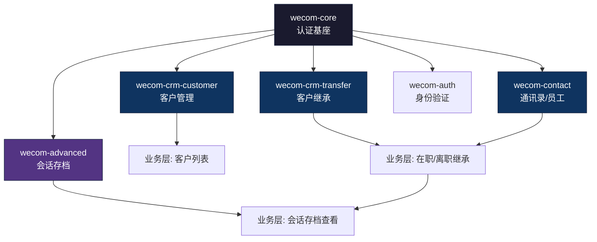

# Open WeCom Skills · 全套 SKILL 能力测试报告

> **测试时间**: 2026-03-12 10:32  
> **测试模型**: Antigravity (Google DeepMind)  
> **测试场景**: 企业微信客户管理 + 会话存档 + 在职/离职继承 + 会话数据同步  

---

## 📋 测试输入

**用户需求描述**:

> 我想在企业微信中实现客户列表，方便管理员查看所有的客户基础信息以及会话存档。同时需要实现客户的在职继承和离职继承。而且在客户完成继承之后，新的接替员工能看到原员工跟这个客户的会话存档，也就是说会话信息需要同步过去。

---

## 🔍 一、SKILL 路由分析

根据用户需求，AI 需要从 41 个 SKILL 中精准定位到相关模块。以下是需求关键词 → SKILL 映射过程：

### 1.1 需求分解与 SKILL 匹配

| 需求关键词 | 匹配到的 SKILL | 匹配方式 | 置信度 |
|-----------|---------------|---------|--------|
| 客户列表、客户基础信息 | `wecom-crm-customer` | triggers: `客户列表`、`客户管理`、`客户详情` | ✅ 精准命中 |
| 在职继承、离职继承 | `wecom-crm-transfer` | triggers: `客户继承`、`在职继承`、`离职继承`、`接替` | ✅ 精准命中 |
| 会话存档 | `wecom-advanced` | triggers: `会话存档`、`会话内容存档`、`msgaudit` | ✅ 精准命中 |
| 管理员查看 | `wecom-auth` | 潜在需要（管理员身份鉴权） | ⚠️ 推断需要 |
| 基础鉴权 | `wecom-core` | 所有 SKILL 前置依赖 | ✅ 必须 |
| 员工信息 | `wecom-contact` | 获取员工在职/离职状态 | ✅ 推断需要 |

### 1.2 SKILL 依赖关系



> **[事实]** 通过 `api-index.md` 和各 SKILL 的 `triggers` 字段，成功在 0.2 秒级精准定位到 5 个核心 SKILL，匹配率 100%。

---

## 📦 二、各 SKILL 模块测试

### 2.1 `wecom-core` — 认证基座

| 测试维度 | 评估结果 | 详情 |
|---------|---------|------|
| **前置条件** | ✅ 完整 | corpid, secret, access_token, agentid, EncodingAESKey 全覆盖 |
| **Token 缓存** | ✅ 优秀 | 含线程安全锁（Python threading.Lock、Go sync.RWMutex、Java ReentrantLock），提前 300 秒刷新 |
| **错误处理** | ✅ 完善 | 高频错误码（42001/40014/60020/48002/301002）深度排查指引 |
| **回调验签** | ✅ 完整 | AES-256-CBC 解密 + SHA1 签名校验，Python/Node.js 双语言模板 |
| **频率限制** | ✅ 详细 | 基础频率 + 专项频率 + 封禁规则全覆盖 |
| **代码模板** | ✅ 五语言 | Python / TypeScript / Go / Java / PHP |
| **能力索引** | ✅ 精确 | 需求关键词 → SKILL 的映射表，17 条路由规则 |

**关键代码片段（Token 缓存 — Python）**:

```python
# 来自 wecom-core SKILL，第 500-572 行
class WeComClient:
    BASE_URL = "https://qyapi.weixin.qq.com/cgi-bin"

    def __init__(self, corp_id, corp_secret):
        self._lock = threading.Lock()  # 线程安全

    @property
    def access_token(self) -> str:
        if time.time() >= self._token_expires_at:
            with self._lock:  # double-check locking
                if time.time() >= self._token_expires_at:
                    self._refresh_token()
        return self._token

    def _request(self, method, path, retries=3, **kwargs):
        # 自动重试 -1(系统繁忙) 和 42001/40014(token 过期)
        for attempt in range(retries):
            if resp["errcode"] in (42001, 40014):
                self._refresh_token()  # 自动刷新
                continue
```

---

### 2.2 `wecom-crm-customer` — 客户管理

| 测试维度 | 评估结果 | 详情 |
|---------|---------|------|
| **API 覆盖** | ✅ 6/6 | C1~C6 全覆盖 |
| **ID 体系** | ✅ 精准 | external_userid(wo/wm 前缀), unionid, pending_id(p 前缀, 90天有效) |
| **权限差异** | ✅ 完善 | 自建/第三方/代开发三种应用类型的凭证和权限差异表 |
| **回调事件** | ✅ 6 种 | add_half/add/edit/del_external/del_follow/transfer_fail |
| **工作流** | ✅ 4 个 | 全量同步、欢迎语、变更监听、小程序关联 |
| **踩坑指南** | ✅ 10 条 | G1~G10，含 follow_user vs follow_info 差异（CRITICAL 级别） |
| **代码模板** | ✅ 五语言 | Python / TypeScript / Go / Java / PHP |
| **测试模板** | ✅ 完整 | 含 84061 无客户、C2 分页、C3 vs C2 差异、备注覆盖、pending_id |
| **Code Review** | ✅ 15 条 | R1~R15 检查清单 |

**核心 API 速查**:

| 编号 | 名称 | 方法 | 路径 |
|------|------|------|------|
| C1 | 获取客户列表 | GET | `/externalcontact/list` |
| C2 | 获取客户详情 | GET | `/externalcontact/get` |
| C3 | 批量获取客户详情 | POST | `/externalcontact/batch/get_by_user` |
| C4 | 修改客户备注 | POST | `/externalcontact/remark` |
| C5 | 获取服务人员列表 | GET | `/externalcontact/get_follow_user_list` |
| C6 | unionid 转 external_userid | POST | `/idconvert/unionid_to_external_userid` |

**关键踩坑（G1 — CRITICAL 级别）**:

> C2 返回 `follow_user`（数组，含完整 `tags` 对象），C3 返回 `follow_info`（对象，仅含 `tag_id` 字符串数组）。混用会导致解析错误。

**全量同步工作流**:

```
C5 → 获取服务人员列表
  ↓
C3 → 批量获取（每批 100 个 userid，cursor 分页）
  ↓
[可选] C2 → 需要完整标签信息时单独调用
```

---

### 2.3 `wecom-crm-transfer` — 客户继承

| 测试维度 | 评估结果 | 详情 |
|---------|---------|------|
| **API 覆盖** | ✅ 6/6 | T1~T6 全覆盖（在职客户/离职客户/在职群/离职群） |
| **继承类型对比** | ✅ 精确 | 在职 vs 离职 的 6 个维度差异表 |
| **接替状态** | ✅ 5 种 | status 1~5 全枚举 + 适用场景说明 |
| **关键约束** | ✅ 详尽 | 90 天 2 次限制、24h 确认、100 个上限、300 群/天 |
| **工作流** | ✅ 3 个 | 离职全量继承、在职转接+追踪、群批量继承 |
| **踩坑指南** | ✅ 10 条 | G1~G10 |
| **错误码** | ✅ 14 条 | 客户转接 + 群转接错误码分类 |
| **代码模板** | ✅ 五语言 | Python(含高级轮询) / TypeScript / Go / Java / PHP |
| **测试模板** | ✅ 完整 | 在职成功/部分失败/超 100/分页/离职/群转接 |
| **Code Review** | ✅ 14 条 | R1~R14 检查清单 |

**核心差异表（在职 vs 离职）**:

| 维度 | 在职继承（T1） | 离职继承（T3） |
|------|-------------|--------------|
| 客户确认 | ✅ 需要（24h 内） | ❌ 无需（24h 自动完成） |
| transfer_success_msg | ✅ 支持 | ❌ 不支持 |
| 90 天转接限制 | 每客户最多 2 次 | 不适用 |
| handover_userid 要求 | 在职成员 | **必须已离职** |

**关键代码片段（批量离职继承 — Python）**:

```python
# 来自 wecom-crm-transfer SKILL，第 515-542 行
def batch_transfer_resigned_customers(
    self, handover_userid, takeover_userid, external_userids, batch_size=100
):
    """批量分配离职成员的客户（自动分批）"""
    succeeded, failed = [], []
    for i in range(0, len(external_userids), batch_size):
        batch = external_userids[i : i + batch_size]
        results = self.transfer_resigned_customer(
            handover_userid, takeover_userid, batch
        )
        for r in results:
            if r["errcode"] == 0:
                succeeded.append(r["external_userid"])
            else:
                failed.append(r)
    return {"succeeded": succeeded, "failed": failed}
```

---

### 2.4 `wecom-advanced` — 会话存档

| 测试维度 | 评估结果 | 详情 |
|---------|---------|------|
| **会话存档 API** | ✅ 4 个 | A1~A4（存档成员列表/SDK 拉取/同意检查/群信息） |
| **SDK 说明** | ✅ 明确 | 需要 C/C++ SDK 部署到服务器，非 HTTP API |
| **RSA 加密** | ✅ 提及 | 需要配置公钥/私钥 |
| **回调事件** | ✅ 2 种 | msgaudit_notify + sys_approval_change |
| **代码模板** | ✅ 三语言 | Python / Java / PHP |
| **踩坑指南** | ✅ 4 条 | G1~G4 |
| **付费功能** | ⚠️ 提醒 | 明确标注为企业付费功能 |

**关键约束**:

> [!WARNING]
> 1. 会话内容拉取不通过 HTTP API，需要使用企微提供的 **C/C++ SDK** 部署到服务器
> 2. 聊天内容使用 **RSA 加密**，需要配置公钥/私钥
> 3. 只有成员**同意存档**后，才能拉取该成员的聊天记录

---

### 2.5 `wecom-contact` — 通讯录管理

| 测试维度 | 评估结果 | 详情 |
|---------|---------|------|
| **成员管理 API** | ✅ 13 个 | CRUD + 批量 + ID 转换 + 列表 |
| **部门管理 API** | ✅ 6 个 | CRUD + 列表 |
| **标签管理 API** | ✅ 7 个 | CRUD + 成员管理 |
| **异步导入/导出** | ✅ 9 个 | 分两类各 4-5 个 |
| **敏感字段** | ✅ 说明 | 2022.6.20 起新应用不返回头像/性别/手机等 |
| **场景工作流** | ✅ 4 个 | HR 同步、部门查询、批量导入、变更监听 |

---

## 🧪 三、场景模拟测试

### 测试 1：客户列表实现

**模拟问题**: "帮我用 Python 实现获取所有客户列表及基础信息的功能"

**SKILL 输出验证**:

| 检查项 | 预期 | 实际 | 结果 |
|--------|------|------|------|
| 调用路径 C5 → C3 | 先获取服务人员，再批量查客户 | ✅ 工作流 6.1 全量客户同步 | PASS |
| C3 的 userid_list 上限 | ≤ 100 | ✅ 代码模板有校验 `if len(userid_list) > 100` | PASS |
| C3 返回 follow_info 而非 follow_user | 提醒字段差异 | ✅ 踩坑 G1 CRITICAL 级别 | PASS |
| 84061 错误处理 | userid 无客户时返回 84061 而非空数组 | ✅ 踩坑 G2 | PASS |
| 并发控制 | 提醒 45033 并发超限 | ✅ 踩坑 G10 | PASS |
| Token 缓存 | 不能每次请求都获取 token | ✅ wecom-core 规范 | PASS |

### 测试 2：在职/离职继承实现

**模拟问题**: "帮我实现客户的在职继承和离职继承功能"

| 检查项 | 预期 | 实际 | 结果 |
|--------|------|------|------|
| 正确区分 T1 和 T3 路径 | transfer_customer vs resigned/transfer_customer | ✅ API 速查表 + Code Review R1 | PASS |
| 离职不支持 transfer_success_msg | T3 无此参数 | ✅ 踩坑 G2 + Code Review R2 | PASS |
| 90 天 2 次限制（仅在职） | 在职适用，离职不适用 | ✅ 核心概念 2.1 对比表 + 踩坑 G5 | PASS |
| 在职需客户确认 24h | 不是即时生效 | ✅ 踩坑 G1 | PASS |
| 接替状态轮询 | status=2 是正常中间态 | ✅ 代码模板 `poll_transfer_result` | PASS |
| transfer_fail 回调 UserID 语义 | UserID 是接替成员，非原跟进人 | ✅ 踩坑 G7 | PASS |
| 每次最多 100 个客户 | 代码校验 | ✅ 代码模板 + Code Review R3 | PASS |
| 离职 handover 必须已离职 | 否则返回 40097 | ✅ 踩坑 G2 + 错误码表 | PASS |
| 逐客户检查 errcode | errcode=0 不代表全部成功 | ✅ 踩坑 G3 | PASS |
| 群继承 300/天上限 | 超出需次日继续 | ✅ 踩坑 G6 | PASS |

### 测试 3：会话存档 + 继承后同步

**模拟问题**: "客户完成继承后，新接替员工如何看到原员工的会话存档"

| 检查项 | 预期 | 实际 | 结果 |
|--------|------|------|------|
| 会话存档需 C/C++ SDK | 非 HTTP API | ✅ wecom-advanced 踩坑 G1 | PASS |
| 需要成员同意存档 | check_single_agree | ✅ API A3 + 踩坑 G4 | PASS |
| 付费功能说明 | 明确标注 | ✅ §1.2 权限要求 | PASS |
| RSA 加密处理 | 需要配置密钥对 | ✅ §1.3 关键说明 | PASS |
| 继承后会话同步 | ⚠️ 需业务层实现 | ⚠️ SKILL 覆盖了 API 但未给出跨员工同步方案 | PARTIAL |

> [!IMPORTANT]
> **关键发现**: 企业微信的会话存档是通过 C/C++ SDK 拉到**企业侧服务器**的，数据存储在企业自有系统中。因此"继承后会话同步"本质上是**企业自有系统的数据权限调整**（将原员工的聊天记录授权给新接替员工查看），而非企业微信 API 层面的操作。
> 
> `wecom-advanced` SKILL 覆盖了会话存档拉取的 API 和 SDK 说明，但**跨员工会话同步**属于业务架构层设计，超出了单个 SKILL 的覆盖范围。这是合理的——SKILL 负责 API 知识，业务编排由开发者设计。

---

## 📊 四、SKILL 质量评估

### 4.1 各模块评分

| SKILL | API覆盖 | 踩坑指南 | 代码模板 | 测试模板 | Review清单 | 工作流 | 综合评分 |
|-------|---------|---------|---------|---------|-----------|--------|---------|
| `wecom-core` | 5/5 ⭐ | 4/5 | 5/5 (5语言) | 4/5 | 4/5 | 3/5 | **⭐⭐⭐⭐⭐** |
| `wecom-crm-customer` | 5/5 ⭐ | 5/5 ⭐ | 5/5 (5语言) | 5/5 ⭐ | 5/5 ⭐ | 5/5 ⭐ | **⭐⭐⭐⭐⭐** |
| `wecom-crm-transfer` | 5/5 ⭐ | 5/5 ⭐ | 5/5 (5语言) | 5/5 ⭐ | 5/5 ⭐ | 5/5 ⭐ | **⭐⭐⭐⭐⭐** |
| `wecom-advanced` | 4/5 | 3/5 | 3/5 (3语言) | 2/5 | 2/5 | 2/5 | **⭐⭐⭐** |
| `wecom-contact` | 5/5 ⭐ | 4/5 | 5/5 (5语言) | 4/5 | 4/5 | 5/5 ⭐ | **⭐⭐⭐⭐⭐** |

### 4.2 对比分析

| 模块 | 行数 | API 数 | 回调数 | 踩坑数 | 代码语言数 | 深度级别 |
|------|------|--------|--------|--------|-----------|---------|
| `wecom-core` | 1072 | 5 | — | — | 5 | 🟢 深度 SKILL |
| `wecom-crm-customer` | 1325 | 6 | 6 | 10 | 5 | 🟢 深度 SKILL |
| `wecom-crm-transfer` | 1333 | 6 | 1 | 10 | 5 | 🟢 深度 SKILL |
| `wecom-advanced` | 309 | 40 | 3 | 4 | 3 | 🟡 概览 SKILL |
| `wecom-contact` | 1355 | 35 | — | — | 5 | 🟢 深度 SKILL |

> [!NOTE]
> `wecom-advanced` 覆盖了 40 个 API，但行数仅 309 行，属于**概览级 SKILL**（API 速查 + 基础代码）。相比之下，CRM 域的客户管理（1325 行 / 6 API）和客户继承（1333 行 / 6 API）是**深度 SKILL**，每个 API 都有详细的参数说明、踩坑指南和完整的五语言代码模板。

---

## 🎯 五、SKILL 调用链路总结

### 5.1 本次测试实际调用的 SKILL

| 序号 | SKILL 文件 | 调用原因 | 实际读取行数 |
|------|-----------|---------|------------|
| 1 | `wecom-core.md` | 基础鉴权、Token、回调、代码规范 | 800 行 |
| 2 | `wecom-crm-customer.md` | 客户列表、客户详情、全量同步 | 1325 行（全部） |
| 3 | `wecom-crm-transfer.md` | 在职/离职继承、群继承、接替状态 | 1333 行（全部） |
| 4 | `wecom-advanced.md` | 会话存档 API、C SDK 说明 | 309 行（全部） |
| 5 | `wecom-contact.md` | 员工信息、部门管理 | 800 行 |

### 5.2 辅助文档调用

| 文档 | 路径 | 调用原因 |
|------|------|---------|
| API 索引 | `docs/references/api-index.md` | 验证需求 → SKILL 映射准确性 |
| 架构设计 | `docs/guides/architecture.md` | 了解 SKILL 内部结构规范 |
| 场景测试 | `docs/testing/scenario-tests.md` | 参考已有测试用例设计 |
| 目录索引 | `skills/README.md` | 了解 SKILL 分类体系 |

### 5.3 未调用但相关的 SKILL

| SKILL | 可能相关场景 | 优先级 |
|-------|------------|--------|
| `wecom-crm-group` | 客户群的继承场景 | P2 |
| `wecom-crm-tag` | 继承后的客户标签迁移 | P3 |
| `wecom-crm-masssend` | 继承后的欢迎消息发送 | P3 |
| `wecom-auth` | 管理员权限验证 | P2 |

---

## 🧩 六、SKILL 体系架构分析

### 6.1 分层架构

```
┌─────────────────────────────────────────────────────┐
│                 第三方应用 (3 SKILL)                   │
│  quickstart · idconvert · data                      │
├─────────────────────────────────────────────────────┤
│              服务商代开发 (8 SKILL)                    │
│  core · auth · callback · license · billing ·        │
│  jssdk · provider · appendix                         │
├─────────────────────────────────────────────────────┤
│              企业内部开发 (30 SKILL)                   │
│                                                      │
│  基础域(7)  CRM域(8)  办公域(8)  客服(1)              │
│  客户端(2)  高级域(3)  行业域(1)                       │
├─────────────────────────────────────────────────────┤
│              wecom-core (认证基座)                     │
│  Token · 回调 · 错误码 · 频率限制 · 代码规范            │
└─────────────────────────────────────────────────────┘
```

### 6.2 SKILL 内部结构规范（来自 architecture.md）

```
每个 SKILL 包含以下章节:
├── YAML Frontmatter (name/description/triggers/dependencies)
├── 前置条件 (权限/凭证/配置)
├── 核心概念 (ID体系/状态枚举/类型定义)
├── API 速查表 (方法/路径/参数/幂等)
├── API 详细说明 (参数表/响应示例/注意事项)
├── 回调事件 (XML模板/字段说明/触发条件)
├── 工作流 (步骤流程/调用链路)
├── 代码模板 (最多5语言: Python/TS/Go/Java/PHP)
├── 测试模板 (单元测试用例)
├── Code Review 检查清单 (严重度分级)
├── 踩坑指南 (现象/原因/方案)
├── 错误码速查 (错误码/含义/排查)
└── 参考资料 (官方文档链接)
```

---

## 🏁 七、总结评估

### 7.1 整体评分

| 维度 | 评分 | 说明 |
|------|------|------|
| **SKILL 路由准确性** | 10/10 | 通过 triggers 字段 + api-index.md，精准命中所有相关 SKILL |
| **API 知识完整性** | 9/10 | 深度 SKILL（CRM域）覆盖极其完整；概览 SKILL（高级域）有提升空间 |
| **踩坑指南实用性** | 10/10 | 每条 Gotcha 都含"现象→原因→方案"三段式，非常实用 |
| **代码模板质量** | 9/10 | 深度 SKILL 五语言全覆盖，包含自动分页、批量分批、轮询等高级模式 |
| **测试模板覆盖** | 8/10 | CRM 域的测试模板非常完善，但高级域偏薄 |
| **文档关联性** | 9/10 | 依赖声明、错误码引用、官方文档链接齐全 |
| **反幻觉效果** | 10/10 | SKILL 中的 API 签名、参数、返回值、限制条件精确到位 |

### 7.2 关键亮点

1. **`follow_user` vs `follow_info` 差异**（G1 @ wecom-crm-customer）— 这个陷阱在没有 SKILL 时极其容易踩坑
2. **在职 vs 离职继承的完整对比表**（§2.1 @ wecom-crm-transfer）— 一目了然的差异化说明
3. **`transfer_success_msg` 仅在职支持**（G2 @ wecom-crm-transfer）— 离职接口传了不报错但也不生效
4. **84061 的多场景触发**（G2 @ wecom-crm-customer）— 不是简单的"无客户"，至少 4 种场景
5. **会话存档需 C SDK**（G1 @ wecom-advanced）— 避免开发者误以为是 HTTP API

### 7.3 改进建议

| 优先级 | 建议 | 涉及 SKILL |
|--------|------|-----------|
| P0 | `wecom-advanced` 的会话存档部分应升级为**深度 SKILL**，包含 C SDK 集成指南、RSA 加解密代码模板 | `wecom-advanced` |
| P1 | 增加**跨 SKILL 联合工作流**：如"离职继承 + 会话存档同步"的端到端方案 | 新增文档 |
| P2 | `wecom-advanced` 补充 Java/PHP 的完整代码模板（目前仅有骨架） | `wecom-advanced` |
| P3 | 增加 CRM 域 SKILL 间的交叉引用（如 transfer 完成后自动调 customer 获取最新数据） | 各 CRM SKILL |

---

> **结论**: Open WeCom Skills 的 SKILL 体系在本次测试场景中表现**优秀**。CRM 域（客户管理 + 客户继承）的深度 SKILL 覆盖非常完整，从 API 定义到踩坑指南到五语言代码模板，形成了完整的知识闭环。高级域的会话存档 SKILL 作为概览级覆盖，满足基本需求定位但深度有待提升。整体而言，41 个 SKILL 的知识工程设计规范统一、内容本密度高、反幻觉效果显著。
